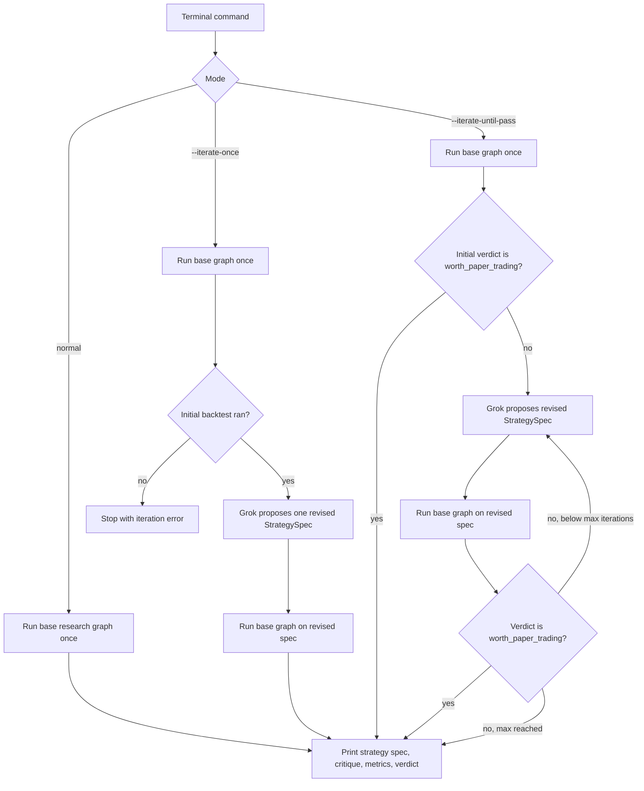
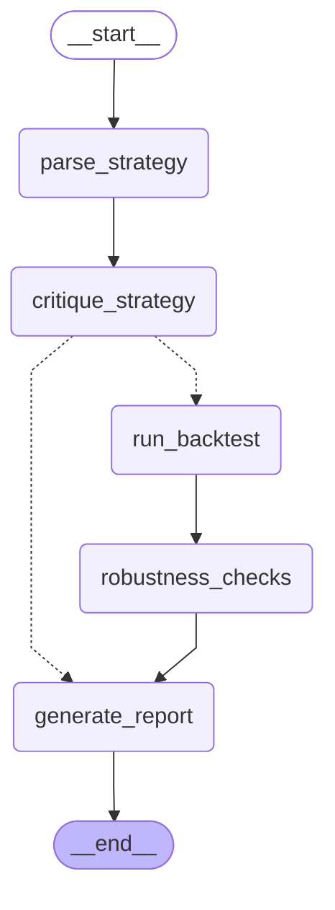

# Agent Workflow

This document explains how the trading research agent moves from a plain-English idea to deterministic backtest results, reports, and optional strategy iteration.

## Quick View



## Base Research Graph

This is the actual LangGraph pipeline exported from `src/trading_research_agent/workflows/research_graph.py`.

To refresh this section after changing the graph, run:

```bash
python scripts/update_workflow_docs.py
```

<!-- BEGIN_BASE_RESEARCH_GRAPH -->

<!-- END_BASE_RESEARCH_GRAPH -->

## Node Responsibilities

- `parse_strategy`: Grok converts the terminal idea into a strict `StrategySpec`.
- `critique_strategy`: deterministic checks reject invalid or unsafe specs before backtesting.
- `run_backtest`: loads market data, selects the backend, and runs deterministic `vectorbt` or `backtesting.py`.
- `robustness_checks`: adds deterministic checks for trade count, benchmark comparison, drawdown, positive return, and Sharpe availability. VectorBT runs also include backend-level walk-forward and Monte Carlo robustness checks.
- `generate_report`: creates the Markdown report and verdict.
- `refine_strategy`: in iteration modes only, Grok sees the previous backtest output and proposes one revised `StrategySpec`.

## CLI Modes

Normal one-pass run:

```bash
trade-research "BTC SMA crossover from 2020-01-01 to 2025-01-15"
```

One revised strategy after the first backtest:

```bash
trade-research --iterate-once "BTC SMA crossover from 2020-01-01 to 2025-01-15"
```

Iterate until the verdict passes, capped at 5 follow-up attempts by default:

```bash
trade-research --iterate-until-pass --max-iterations 5 "BTC SMA crossover from 2020-01-01 to 2025-01-15"
```

## What The LLM Can And Cannot Do

The LLM can:

- parse a vague idea into a structured strategy spec
- critique and propose a revised strategy spec during iteration
- write report text

The LLM cannot:

- calculate returns, drawdown, Sharpe, trade count, or benchmark results
- calculate walk-forward or Monte Carlo robustness results
- change market data
- skip fees, slippage, or benchmark comparison
- mark a strategy as passing without deterministic metrics

## Update Checklist

When changing the workflow:

1. Update the code under `src/trading_research_agent/workflows/` or `src/trading_research_agent/nodes/`.
2. Run `python scripts/update_workflow_docs.py`.
3. If iteration behavior changed, manually update the `Quick View` section above.
4. Run `python -m pytest` and `python -m ruff check`.
